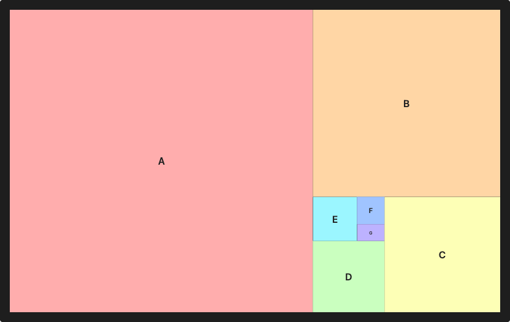

# Nautilus

**The golden spiral, in CSS.** `nautilus-grid` on npm.

A golden-ratio (Fibonacci-style) spiral grid layout in pure CSS. Zero JavaScript,
under 1 KB gzipped.

Cells are squares scaled by powers of φ (≈ 0.618) and rotated 90° around the
spiral's convergence point, producing the classic golden-spiral tiling. The
last cell fills the remaining golden rectangle, so the eye of the spiral has no
empty wedge.



> **Status: 0.x.** The API may still shift before `1.0.0`. Pin a minor version.

## Install

```sh
npm install nautilus-grid
```

```js
import 'nautilus-grid';            // dist/spiral-grid.css
// or: import 'nautilus-grid/min'; // dist/spiral-grid.min.css
```

Or via CDN, no build step:

```html
<link rel="stylesheet" href="https://unpkg.com/nautilus-grid@0.1/dist/spiral-grid.min.css">
```

## Usage

```html
<div class="spiral-grid">
  <div class="spiral-grid__cell"><div class="spiral-grid__content">1</div></div>
  <div class="spiral-grid__cell"><div class="spiral-grid__content">2</div></div>
  <div class="spiral-grid__cell"><div class="spiral-grid__content">3</div></div>
  <div class="spiral-grid__cell"><div class="spiral-grid__content">4</div></div>
  <div class="spiral-grid__cell"><div class="spiral-grid__content">5</div></div>
</div>
```

- `.spiral-grid` is a golden rectangle (1.618 : 1) at `width: 100%`. Size it
  with plain `width` / `max-width`.
- `.spiral-grid__cell` is positioned, scaled and rotated automatically by its
  position (`:nth-child`). Style its `background` freely.
- `.spiral-grid__content` is counter-rotated so content stays upright, with
  font-size compensated for the cell's scale. Put your content here.

### Markup rules

- **Up to 10 cells.** Cells beyond the 10th are hidden. Need more? Put two
  spirals side by side.
- **Only cells may be `<div>` children** of `.spiral-grid`. The fill cell is
  found with `:last-of-type`, so use another tag (e.g. `<span>`) for any
  overlay element inside the container.

## Modifiers

On `.spiral-grid`:

| Class | Effect |
|---|---|
| `spiral-grid--reverse` | Mirror horizontally — spiral coils in from the left |
| `spiral-grid--portrait` | Tall golden rectangle (1 : 1.618) |
| `spiral-grid--auto` | Switch to portrait automatically when the container is taller than wide (container query) |
| `spiral-grid--no-fill` | Keep the last cell square, leaving the wedge at the eye visible |
| `spiral-grid--hero-rotate` | Pre-rotate each cell's content by 90° × its index, so after a zoom step the new hero reads upright (see `doc/tunnel.md`) |

On `.spiral-grid__content`:

| Class | Effect |
|---|---|
| `spiral-grid__content--scroll` / `--scroll-y` | Make the cell a vertical scroll container |
| `spiral-grid__content--scroll-x` | Horizontal scroll container (image strips, timelines) |

Scrolling works best on cells 1–5; deeper cells are too small for a usable
scrollbar.

## Custom properties

Set these on `.spiral-grid`:

| Property | Default | Purpose |
|---|---|---|
| `--spiral-grid-gap` | `0px` | Visible gutter between cells. Same width at every depth. |
| `--spiral-grid-transition` | `none` | Cell transition, e.g. `background 0.4s ease` |

```html
<div class="spiral-grid" style="--spiral-grid-gap: 8px">…</div>
```

`--spiral-grid-tracks` and `--spiral-grid-eye` are internal — don't override
them.

**Sizing content per cell:** every cell is a container, so `cqi` inside
`.spiral-grid__content` means *that cell's* width — `font-size: 10cqi` scales
type with the cell at every depth.

**Gap and depth:** because cells shrink exponentially, a large gap makes the
deepest cells vanish. Keep the gap small relative to the container, or scale
it with the container (e.g. `--spiral-grid-gap: 0.5cqi`).

## Browser support

Plain CSS Grid — no transforms, no `pow()`. Needs `aspect-ratio`,
`writing-mode` (for `--portrait`) and container queries (for `--auto` and
`cqi`): every evergreen browser since 2023.

## Accessibility

Under `prefers-reduced-motion: reduce`, the spiral degrades to a plain stacked
column: no transforms, no rotation, cells in source order. Content stays in
DOM order at all times, so screen readers and keyboard focus follow cell order
regardless of the visual spiral.

## Examples

Clone the repo and open any of these in a browser:

- [`examples/index.html`](examples/index.html) — gallery: fill, reverse,
  portrait, multi-spiral, responsive resize
- [`examples/gap.html`](examples/gap.html) — the gap at every depth
- [`examples/scroll.html`](examples/scroll.html) — per-cell scrolling
- [`examples/scroll-zoom.html`](examples/scroll-zoom.html) — experimental
  scroll-driven zoom (not part of the 0.1 API)
- [`examples/infinite-zoom.html`](examples/infinite-zoom.html) — the tunnel:
  infinite zoom into the eye, ~130 lines of JS on top of the CSS
  (add `?images` for photos)

## How it works

The whole spiral is one 6×6 CSS Grid: ten cells share only seven distinct
lines in each direction, and the six track sizes are powers of φ.
[`doc/shared-lines.md`](doc/shared-lines.md) explains it from scratch;
[`doc/tunnel.md`](doc/tunnel.md) explains the infinite zoom. Design notes and
decision records live in [`doc/`](doc/).

## Development

```sh
npm install
npm test        # geometry check: tracks sum to 1, every cell area is square
npm run build   # src/spiral-grid.css → dist/ (+ minified)
npm run size    # gzip size check (limit 2 KB)
```

## License

[MIT](LICENSE) © Henky Wu
